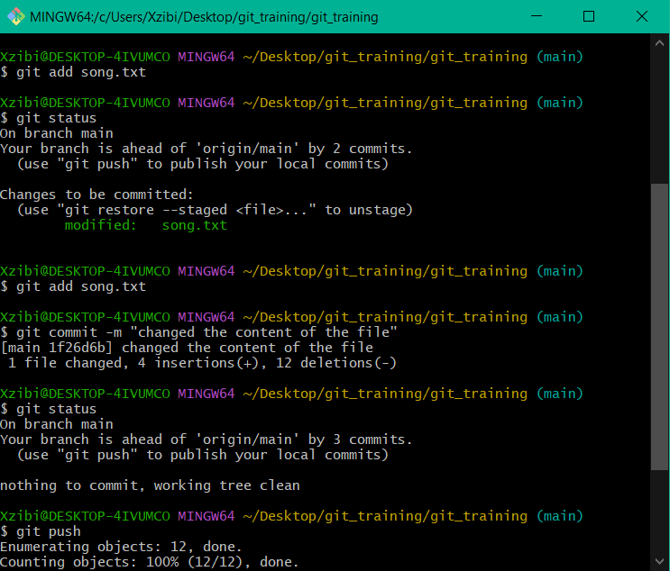
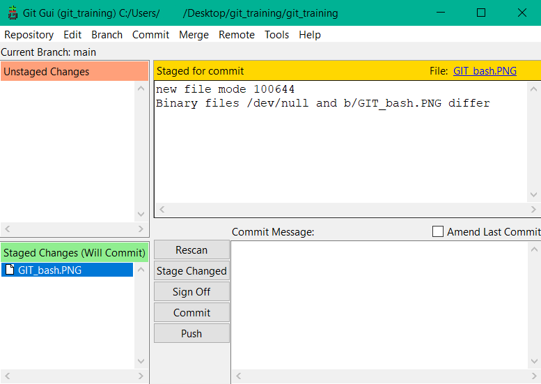
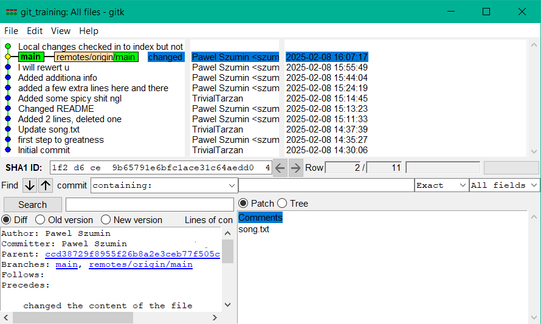
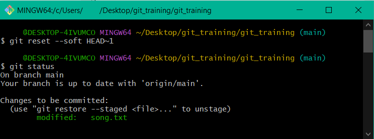
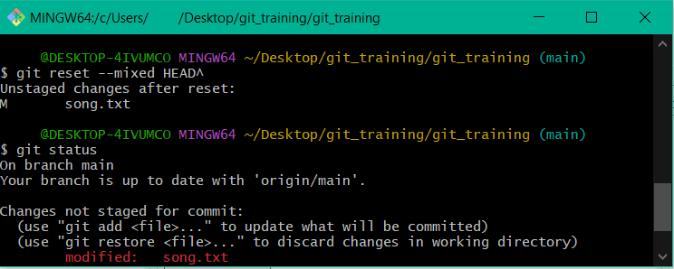

<h1 align="center">GIT training</h1>

<p align="center"></p>

You can download Git here: [Git SCM Downloads](http://git-scm.com/downloads) and install it with the default settings.

### Generating a Pair of SSH Keys

```sh
ssh-keygen -t rsa -C "korWIN@winwin.com"
```

The public key (`id_rsa.pub`) should be sent to the owner of the repository to obtain work rights, or uploaded to profile settings in Bitbucket, GitHub, or GitLab.

### Username and Email Settings

```sh
git config --global user.name "Janusz Korwin-Mikke"
git config --global user.email "korWIN@winwin.com"
```

## Adding Changes

### Staging Files

- To add all changed files to the commit:

  ```sh
  git add .
  ```

- To add a specific file:

  ```sh
  git add song.txt
  ```

### Committing Changes

```sh
git commit -m "Describe the changes here"
```

## Git GUI Tools

- To use the Git GUI instead of the terminal:

  ```sh
  git gui &
  ```

<p align="center"></p>


- To open a window showing all commits:

  ```sh
  gitk &
  ```

<p align="center"></p>

## Reverting Changes

### Working Directory

- Discard changes in a specific file:

  ```sh
  git checkout -- file.txt
  ```

- Discard all local changes:

  ```sh
  git checkout .
  ```

- Remove untracked files and directories:

  ```sh
  git clean -xdf
  ```

### Staging Area (Index)

- Unstage a file:

  ```sh
  git reset file.txt
  ```

  ```sh
  git reset --soft HEAD~1
  ```

<p align="center"></p>

  ```sh
  git reset --mixed HEAD^
  ```

<p align="center"></p>

### Local Branch

- Move HEAD back by two commits:

  ```sh
  git reset HEAD^^  # Equivalent to HEAD~2
  ```

- Amend the last commit:

  ```sh
  git commit --amend -m "Updated commit message"
  ```

## Remote Repository

- Revert a specific commit (already commited to the remote repo) by creating a new commit that undoes the changes:

  ```sh
  git revert <commit-hash>


# .gitignore Guidelines

  ### .gitignore
- Create a `.gitignore` file in the root directory.
#### Ignoring Single Files
- Specify filename and extension:
`example.txt`
#### Keeping Single Files
- Use an exclamation mark to keep a specific file:
`!example.txt`
#### Ignoring Multiple Files by Extension
- Use a wildcard for file extensions:
`*.txt`
#### Ignoring Multiple Files by Name
- Exclude files with the same name pattern:
`example*`
#### Folders
- Ignore entire directories:
`examples/`
#### Files Inside Folders
- Apply the same rules to files inside folders:
`examples/example.txt`
