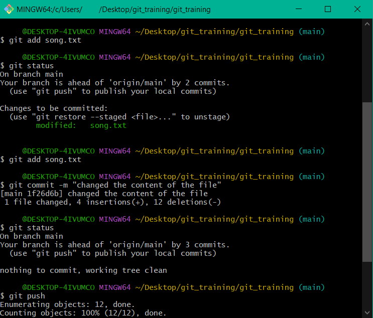

<h1 align="center">GIT training</h1>

<p align="center"></p>

You can download Git here: [Git SCM Downloads](http://git-scm.com/downloads) and install it with the default settings.

### Generating a Pair of SSH Keys

```sh
ssh-keygen -t rsa -C "korWIN@winwin.com"
```

The public key (`id_rsa.pub`) should be sent to the owner of the repository to obtain work rights, or uploaded to profile settings in Bitbucket, GitHub, or GitLab.

### Username and Email Settings

```sh
git config --global user.name "Janusz Korwin-Mikke"
git config --global user.email "korWIN@winwin.com"
```

## Adding Changes

### Staging Files

- To add all changed files to the commit:

  ```sh
  git add .
  ```
<p align="center"></p>

- To add a specific file:

  ```sh
  git add song.txt
  ```

### Committing Changes

```sh
git commit -m "Describe the changes here"
```

## Git GUI Tools

- To use the Git GUI instead of the terminal:

  ```sh
  git gui &
  ```

<p align="center"></p>


- To open a window showing all commits:

  ```sh
  gitk &
  ```

<p align="center"></p>

## Reverting Changes

### Working Directory

- Discard changes in a specific file:

  ```sh
  git checkout -- file.txt
  ```

- Discard all local changes:

  ```sh
  git checkout .
  ```

- Remove untracked files and directories:

  ```sh
  git clean -xdf
  ```

### Staging Area (Index)

- Unstage a file:

  ```sh
  git reset file.txt
  ```

  ```sh
  git reset --soft HEAD~1
  ```

<p align="center"></p>

  ```sh
  git reset --mixed HEAD^
  ```

<p align="center"></p>

### Local Branch

- Move HEAD back by two commits:

  ```sh
  git reset HEAD^^  # Equivalent to HEAD~2
  ```

- Amend the last commit:

  ```sh
  git commit --amend -m "Updated commit message"
  ```

### Remote Repository

- Revert a specific commit (already commited to the remote repo) by creating a new commit that undoes the changes:

  ```sh
  git revert <commit-hash>
  ```

  
## Branch and Merge 


#### Listing Branches
To see all the branches in your repository
```sh
git branch
```
The branch you're currently on will be marked with (`*`).

#### Creating a New Branch
To create a new branch at your current commit
```sh
git branch [branch-name]
```

#### Switching Branches
To change to another branch and update your working directory
```sh
git checkout [branch-name]
```

#### Merging Branches
To merge the changes from a specified branch into your current branch
```sh
git merge [branch]
```

#### Viewing Commit History
To display the complete commit history of the current branch
```sh
git log
```


## .gitignore Guidelines

<p align="center"></p>

